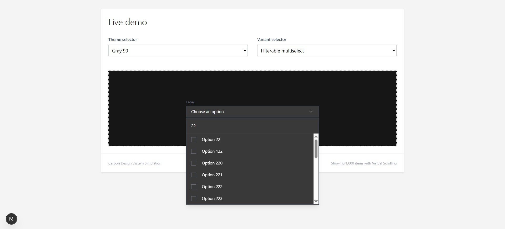
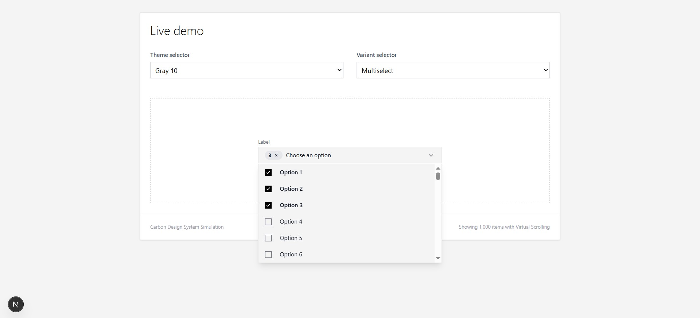
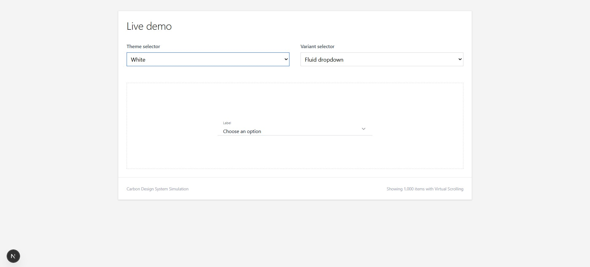

🚀 Advanced Carbon-Style Select Component

​A high-performance, fully customizable, and accessible Select/Dropdown component for React and Next.js.
​Designed with pixel-perfect precision inspired by the IBM Carbon Design System (https://carbondesignsystem.com/components/dropdown/usage/), this component features virtualization for handling large datasets (1,000+ items), extensive theming, and multiple layout variants including fluid and multi-select modes.

📸 Screenshots

## Screenshots

​✨ Key Features

​🎨 4 Native Themes: Full support for Carbon themes: White, Gray 10, Gray 90, and Dark (High Contrast).
​📐 7 Layout Variants: 
​Dropdown (Standard)
​Inline (Transparent background)
​Fluid & Fluid Condensed
​Multiselect
​Filterable Multiselect (With search input)
​Fluid Multiselect
​🚀 High Performance: Uses Virtualization (react-window) to render thousands of options instantly without lag.
​✅ Advanced Multi-Selection: 
​Checkbox UI with active states.
​Badge counter (e.g., "20 items") with a quick clear button.
​🔍 Isolated Filtering: Search functionality is scoped strictly to filterable variants, preserving state across other modes.
​♿️ Accessible: Built on top of Headless UI for full keyboard navigation and screen reader support.
​📱 Responsive: Fully styled using Tailwind CSS.

​🛠️ Installation

        git clone https://github.com/parsabdr-dev/Dropdown-Select-with-react.js-and-next.js.git

 Install dependencies:
This project relies on a few key libraries. Run the following command:

                npm install @headlessui/react @heroicons/react react-window clsx
                npm install -D @types/react-window

This project relies on a few key libraries. Run the following command:

Bash
                npm install @headlessui/react @heroicons/react react-window clsx
                npm install -D @types/react-window

💻 Usage

​Here is a basic example of how to implement the component in your Next.js/React page:

                import { useState } from 'react';

                import AdvancedSelect from '@/components/AdvancedSelect/AdvancedSelect';

                import { SelectItem } from '@/components/AdvancedSelect/types';

// 1. Define your data
const items: SelectItem[] = [
  { id: 1, label: 'Option 1', value: 'opt-1' },
  { id: 2, label: 'Option 2', value: 'opt-2' },
  // ... supports 1000+ items
];

export default function MyPage() {
  const [selected, setSelected] = useState<SelectItem[]>([]);

  return (
    

      <AdvancedSelect
        label="Select Label"
        placeholder="Choose an option"
        items={items}
        value={selected}
        onChange={setSelected}
        
        // Configuration
        theme="gray-10"           // white | gray-10 | gray-90 | dark
        variant="multiselect"     // dropdown | fluid | filterable-multiselect | ...
      />
    

  );
}

💻 Usage
Here is a basic example of how to implement the component in your Next.js/React page:

TypeScript
        import { useState } from 'react';
        import AdvancedSelect from '@/components/AdvancedSelect/AdvancedSelect';
        import { SelectItem } from '@/components/AdvancedSelect/types';

// 1. Define your data
const items: SelectItem[] = [
  { id: 1, label: 'Option 1', value: 'opt-1' },
  { id: 2, label: 'Option 2', value: 'opt-2' },
  // ... supports 1000+ items
];

export default function MyPage() {
  const [selected, setSelected] = useState<SelectItem[]>([]);

  return (
    

      <AdvancedSelect
        label="Select Label"
        placeholder="Choose an option"
        items={items}
        value={selected}
        onChange={setSelected}
        
        // Configuration
        theme="gray-10"           // white | gray-10 | gray-90 | dark
        variant="multiselect"     // dropdown | fluid | filterable-multiselect | ...
      />
    

  );
}

⚙️ API Documentation
Props (AdvancedSelectProps)

items	SelectItem[]	Required	Array of data objects to display in the list.		
value	SelectItem[]	[]	The currently selected item(s).		
onChange	(items: SelectItem[]) => void	Required	Callback function fired when selection changes.		
theme	Theme	white'	Color theme of the component.		
variant	Variant	dropdown'	Layout and functional mode of the component.		
label	string	Label'	The label text displayed above or inside the input.		
placeholder	string	Choose...'	Text displayed when no selection is made.		
disabled	boolean	FALSE	Disables interaction with the component.		

Types

Theme
        'white'

        'gray-10'

        'gray-90'

        'dark'

Variant                       

        'dropdown' - Standard single select.

         'inline' - Minimalist, transparent background.

        'fluid' - Full width, bottom border only.

        'fluid-condensed' - Smaller height fluid variant.

        'multiselect' - Multiple selection with checkboxes.

        'filterable-multiselect' - Multiple selection with a search bar.

        'fluid-multiselect' - Fluid layout with multiple selection.

📂 Project Structure

src/
├── app/
│   └── test-select/       # Demo page showing all variants
├── components/
│   └── AdvancedSelect/
│       ├── AdvancedSelect.tsx  # Main Component Logic
│       ├── hooks.ts            # Custom hooks (Search/Filter logic)
│       ├── styles.ts           # Tailwind classes & Theme definitions
│       └── types.ts            # TypeScript interfaces

📌 Author

Parsa Badri Computer Engineering Graduate Passionate about Frontend & AI Development

GitHub: https://github.com/parsabdr-dev

